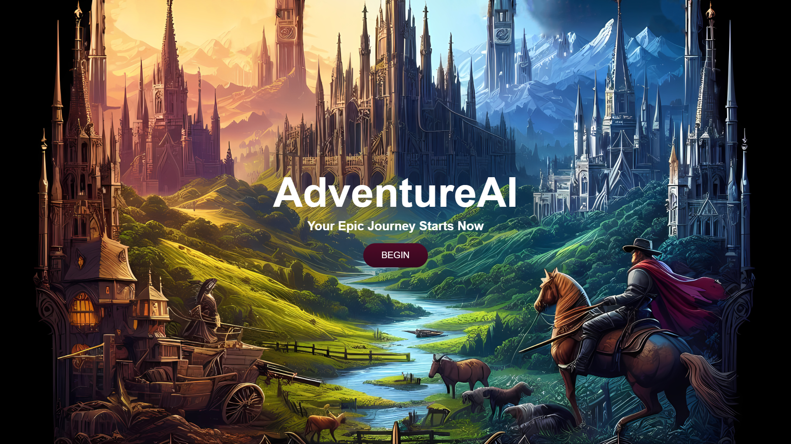
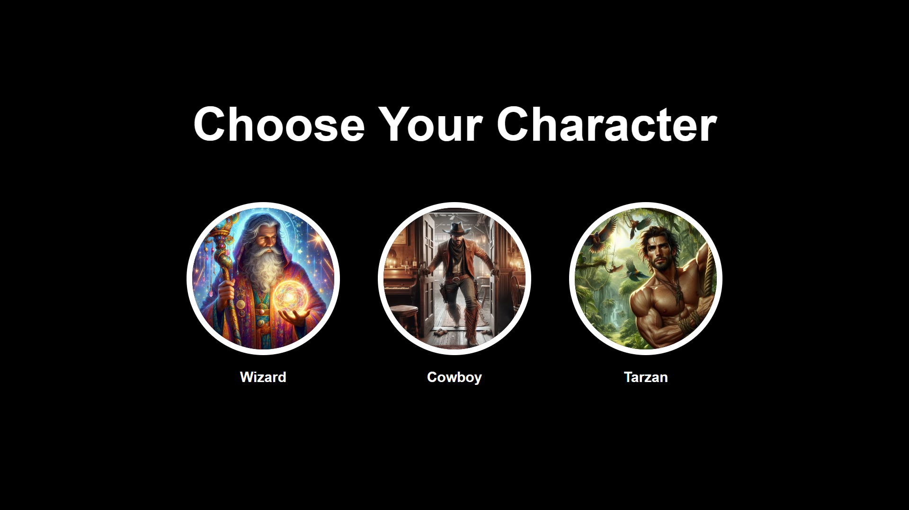
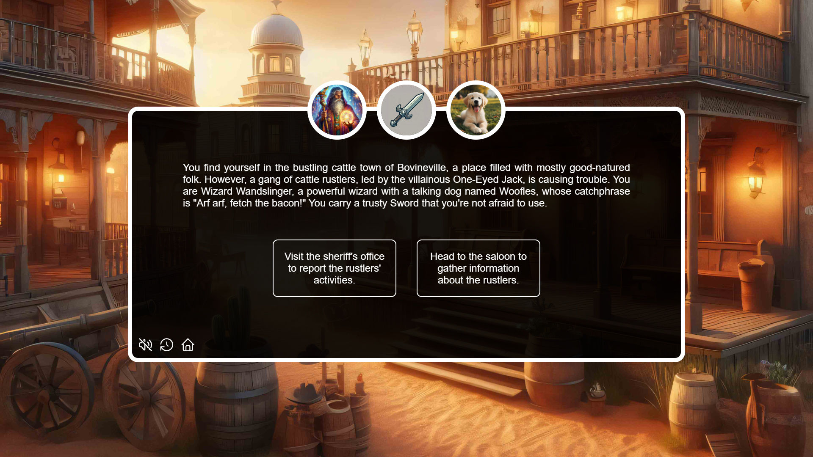
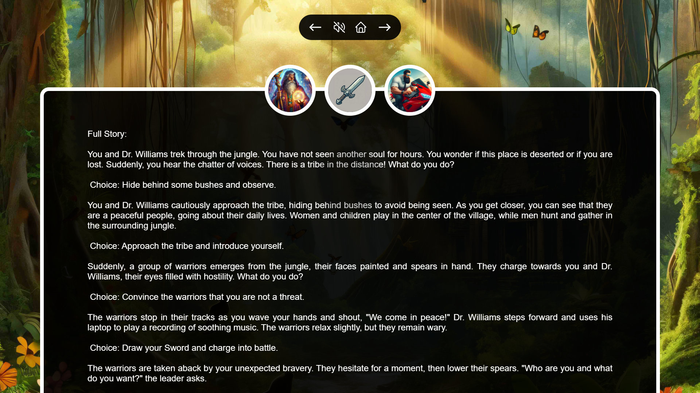

# AdventureAI

Welcome to AdventureAI, the humorous choose-your-own-adventure game powered by Google's Gemini AI! Get ready to embark on an interactive journey filled with laughter, excitement, and unexpected twists. In this game, you'll explore various settings, encounter quirky characters, wield unique weapons, and enlist the help of sidekicks, all while experiencing a new story every time you play.

[PLAY HERE](https://adventureai.duckdns.org{:target="_blank"})

## Screenshots

**Start Screen**
   

**Select Your Character**
   

**Game Play**
   

**History**
   

## How to Play

1. **Choose Your Settings**: Select your character, weapon, sidekick, and setting to start your adventure.
2. **Interact with Gemini**: AdventureAI utilizes JavaScript to interact with Gemini through the API. Gemini will set up a story based on your initial choices and provide you with two options at each step.
3. **Make Your Choices**: Every decision you make affects the outcome of your adventure. Choose wisely!
4. **Experience Unique Content**: With different combinations of settings, characters, and choices, no two adventures are the same.

## Features

- **Dynamic Storytelling**: AdventureAI generates a unique story for each playthrough, ensuring endless entertainment.
- **Interactive Gameplay**: Engage with Gemini AI to navigate through the game's branching paths and make decisions that shape your adventure.
- **Variety of Choices**: Explore diverse characters, weapons, sidekicks, and settings to create your own personalized experience.
- **Immersive Experience**: Enjoy vivid artwork and thematic music tailored to each setting, enhancing the atmosphere of your adventure.

## Story History

AdventureAI keeps a record of all stories played, stored in a MariaDB database accessible via MySQL. Easily browse through past adventures, complete with original theme music and settings.

## Get Started

This is a coding preview, but stay tuned for the live hosting coming soon!

